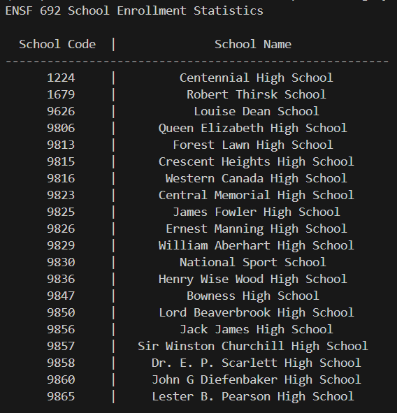
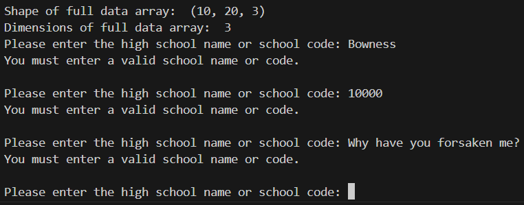
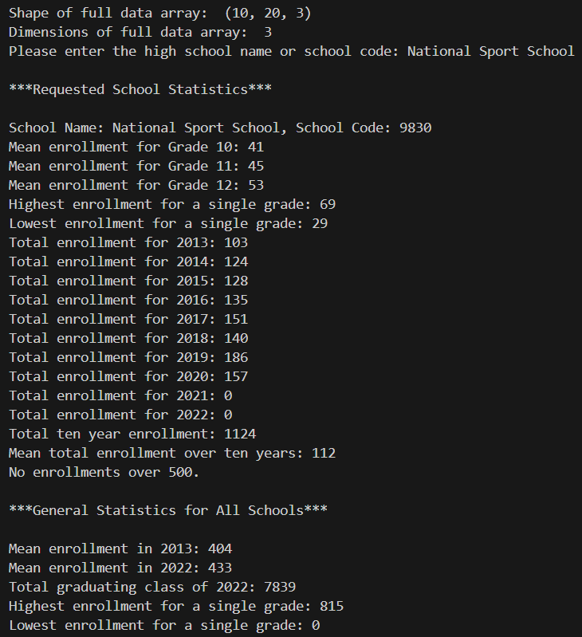
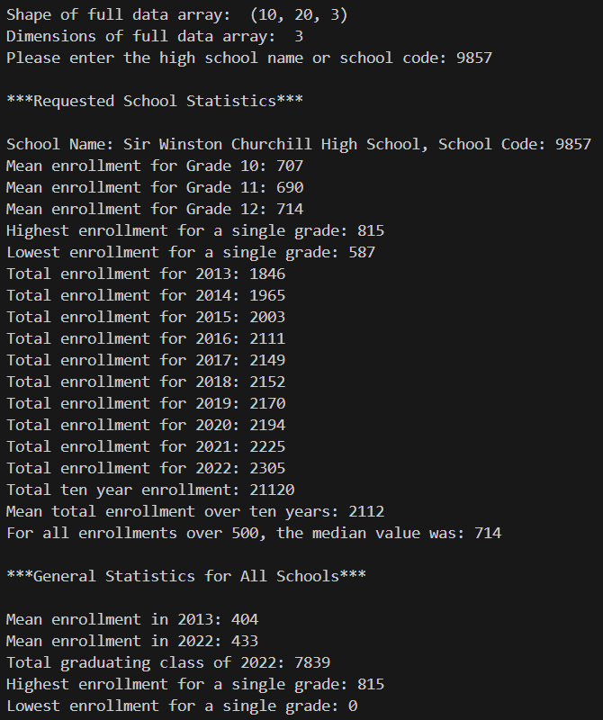

Author: Andy Allard

# Solution Assignment #3

## Introduction

The program will provide pertinent information on school enrollment

## How to use

The program first prompts a user for either a school code or a school name. If will provide a handy reference chart to get started.

If you enter a code or school name incorrectly, you'll be asked to try again.

Once successful, here are two examples of the output you can expect.

Enjoy!
